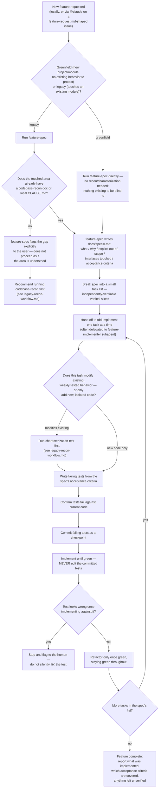

# Feature-development workflow: spec → TDD

How a new feature gets built under this scaffold, split by greenfield vs. legacy — and why the
split matters (see `docs/research/agentic-feature-development-2026.md` §7–8 for the research
behind the branch).

## Notes

- **`feature-spec` always runs first, on both branches.** The greenfield/legacy split changes
  *what else* runs before implementation (nothing extra vs. a recon-coverage check), not whether a
  spec exists — this guards against the core failure mode the skill targets: an agent producing
  plausible code that quietly solves the wrong problem because nobody grounded it in a real spec.
- **The recon-coverage check in step `C3` cannot be skipped even if the user seems confident the
  area is well understood** — per `feature-spec/SKILL.md`'s own guardrail, the check costs one file
  lookup and the risk of skipping it is a shared blind spot between the agent and the reviewer.
- **This composes identically for remote/GitHub-triggered work.** `CLAUDE.md`'s "Before starting a
  new feature" section is read the same way by a local session and by the GitHub Action, so no
  extra workflow-level logic is needed to route an `@claude`-tagged issue through this same flow.

See also: `docs/research/agentic-feature-development-2026.md`;
`scaffold/.claude/skills/feature-spec/SKILL.md`; `scaffold/.claude/skills/tdd-implement/SKILL.md`;
`scaffold/.claude/agents/feature-implementer.md`; `scaffold/.github/ISSUE_TEMPLATE/feature-request.md`.
