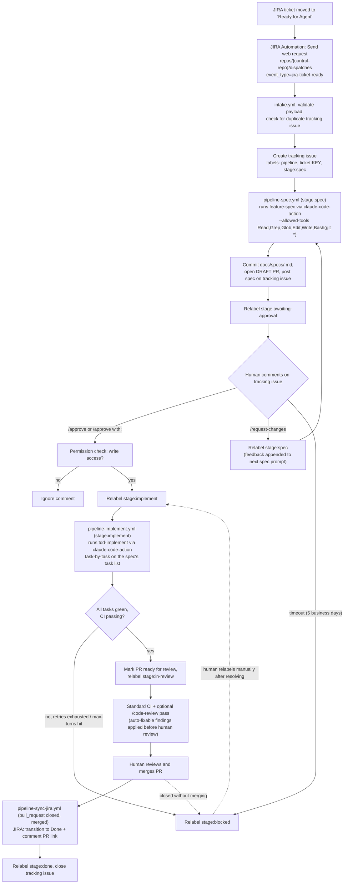

# JIRA pipeline flow: ticket → tracking issue → merged PR

The state machine a single JIRA ticket moves through under `docs/specs/jira-pipeline/`. Composes
with `trigger-map.md` (this adds a new trigger branch alongside the existing `@claude`-mention
trigger) and `feature-development-workflow.md` (unchanged — this pipeline hands off into it
unmodified at the spec/implement steps).

## Notes

- **The tracking issue is the only state object** — see `docs/specs/jira-pipeline/02-orchestrator-and-state.md`
  for why a database/hosted service was deliberately avoided given the "GitHub Actions only"
  hosting decision.
- **`stage:blocked` is terminal until a human acts.** No workflow auto-retries out of it — a
  comment explaining the failure is always posted before the relabel, consistent with
  `03-plan-approval-gate.md`'s approach to timeouts and rejection limits.
- **The permission check at `/approve` mirrors the one `claude-code-action` itself already applies**
  to who can trigger a run (`remote-agents-2026.md` §3) — approval to spend agent budget and merge
  code downstream needs the same bar.
- **Everything right of "runs feature-spec" / "runs tdd-implement" is unchanged scaffold behavior.**
  This diagram's only new contribution is everything left of and around those two boxes — getting a
  ticket into the existing loop and getting the result back out to JIRA.

See also: `docs/specs/jira-pipeline/00-overview.md` (full spec), `docs/diagrams/trigger-map.md`,
`docs/diagrams/feature-development-workflow.md`.
