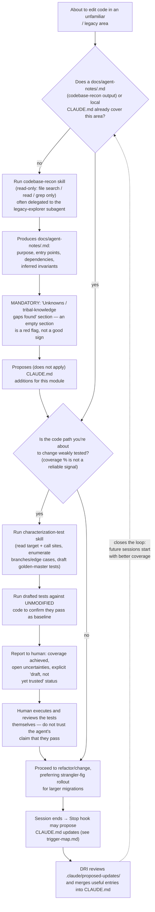

# Legacy/recon workflow: working safely in unfamiliar code

The decision flow for touching an existing module on a large, poorly tested/documented codebase —
the scaffold's core defense against the tribal-knowledge gap that both the agent and a human
reviewer can share.

## Notes

- **The riskiest failure mode here is a shared blind spot**, not hallucination: a reviewer often
  lacks the same tribal knowledge the agent lacks, so neither can catch what neither knows. That's
  why `codebase-recon`'s "unknowns" section and `characterization-test`'s human-execution
  requirement are both non-negotiable steps in this flow, not optional polish.
- **`codebase-recon` and `characterization-test` are separate, sequential skills**, not one
  combined step — recon establishes *what the code does and what's unknown*; characterization
  pins *current behavior* before it changes. Running characterization first without recon risks
  missing an invariant recon would have surfaced (e.g., "always called inside a transaction").
- **Nothing in this flow edits `CLAUDE.md` directly.** Every proposed addition — from recon or from
  the Stop hook — lands in `.claude/proposed-updates/` for a human to merge deliberately.

See also: `docs/research/ai-agents-legacy-codebases-2026.md` §3, §6, §8–9 (the research this flow
operationalizes); `scaffold/.claude/skills/codebase-recon/SKILL.md`;
`scaffold/.claude/skills/characterization-test/SKILL.md`; `scaffold/.claude/agents/legacy-explorer.md`.
