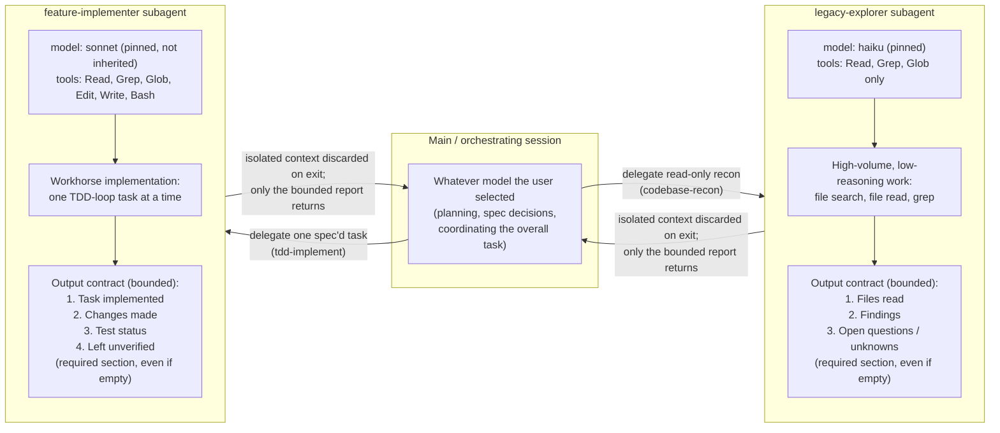

# Subagent context isolation & model routing

Why work gets delegated to subagents instead of running in the main session, and why each
subagent is pinned to a specific model rather than inheriting whatever model is driving the
orchestrating session. Grounded in `docs/research/token-cost-optimization-2026.md` §5.

## Notes

- **Isolation is a token-cost lever, not just a context-cleanliness one.** Exploration that could
  dump dozens of files' worth of tokens into the main loop instead gets discarded when a subagent
  exits — only its structured, bounded report re-enters the persistent (and cache-relevant) main
  session context.
- **Routing is deliberately asymmetric, not just "delegate everything."** `legacy-explorer` is
  pinned to a small model because recon is high-volume, low-reasoning search/read work.
  `feature-implementer` is pinned to a mid-tier model explicitly — not inherited from the main
  session — so a heavier (and more expensive) orchestrator model chosen for planning elsewhere
  never silently ends up running routine TDD-loop grunt work.
- **Both subagents' output contracts are fixed and bounded by design.** This caps output-token
  cost by construction — the agent isn't free to pad a report of unbounded length, and the
  "required even if empty" clauses (unknowns / left-unverified) exist specifically to stop
  confident-sounding brevity from hiding a real gap.
- **Bounded output ≠ hidden nuance.** Both contracts require the empty-looking sections
  (`legacy-explorer`'s "unknowns", `feature-implementer`'s "left unverified") to be stated
  explicitly rather than omitted — a token-cost-conscious contract still has to leave room for
  "nothing was left unverified" as an explicit claim, not silence that could mean either thing.

See also: `docs/research/token-cost-optimization-2026.md`;
`scaffold/.claude/agents/legacy-explorer.md`; `scaffold/.claude/agents/feature-implementer.md`.
