# Trigger map: how a session starts and what fires

What kicks off a Claude Code session against this scaffold, and what runs automatically once it
has, whether the session is local (CLI/JetBrains) or remote (GitHub-triggered).

```mermaid
flowchart TD
    subgraph local["Local session (CLI or JetBrains plugin)"]
        L0["Developer runs `claude` / opens the JetBrains tool window"] --> L1
        L1["SessionStart hook fires unconditionally\nscaffold/.claude/hooks/session-start-context.sh\n(read-only, no side effects)"] --> L2
        L2["Prints CLAUDE.md 'Known landmines' section\n+ filenames (not content) of any pending\n.claude/proposed-updates/*"] --> L3
        L3["Normal session: skills / subagents run\nper CLAUDE.md guidance"] --> L4
        L4["Session ends"] --> L5
        L5["Stop hook fires\nscaffold/.claude/hooks/stop-propose-doc-updates.sh"] --> L6
        L6{"Did this session learn\nsomething worth documenting?"}
        L6 -- yes --> L7["Agent writes a proposal file to\n.claude/proposed-updates/<timestamp>-<topic>.md\n(never edits CLAUDE.md, never commits)"]
        L6 -- no --> L8["No proposal written"]
    end

    subgraph remote["Remote session (GitHub Action)"]
        R0["Someone comments '@claude ...' on an issue\nor a PR review comment"] --> R1
        R1{"issue_comment.created OR\npull_request_review_comment.created?"}
        R1 -- no --> R2["Workflow does not run"]
        R1 -- yes --> R3["Job guard:\nif: contains(comment.body, '@claude')"]
        R3 --> R4["scaffold/.github/workflows/claude.yml\nruns anthropics/claude-code-action@v1"]
        R4 --> R5["Checks out repo, reads CLAUDE.md\nidentically to a local session"]
        R5 --> R6["If the issue matches feature-request.md,\nCLAUDE.md's 'Before starting a new feature'\nsection routes it into feature-spec first"]
    end

    L7 -.->|"reviewed by DRI next session\n(see legacy-recon-workflow.md)"| L1
```

## Notes

- **Local hooks are unconditional** — no matcher is configured for either `SessionStart` or `Stop`
  in `scaffold/.claude/settings.json`, so they fire on every session regardless of what's being
  worked on.
- **The Stop hook never writes to `CLAUDE.md` directly and never commits.** It only ensures
  `.claude/proposed-updates/` exists and instructs the *agent* to optionally write a proposal file
  there — enforced by convention in the script's own comments, not by a technical guardrail. See
  `SCAFFOLD-README.md`'s "Known open concern" for the one gap in this loop (no de-duplication
  across sessions).
- **The remote trigger is narrower than it might look.** Only a comment containing `@claude` on an
  existing issue or PR fires the Action — a newly opened issue's title/body alone does not (this
  diagram reflects a fix made to a stale comment in `claude.yml` that previously implied
  otherwise). Add an `issues: [opened]` trigger yourself if you want that behavior.
- **CI has no human approval gate.** Unlike the local session's manual-approval default
  (`scaffold/.claude/settings.json` → `defaultMode: "default"`), the GitHub Action runs
  unattended — tool scope has to be constrained in `claude.yml` itself (`claude_args` /
  `--allowedTools`) rather than relying on a person clicking approve.

See also: `docs/research/remote-agents-2026.md` (setup mechanics, permission scoping without a
human in the loop) and `SCAFFOLD-README.md` (validation steps 1, 5, and 8).
